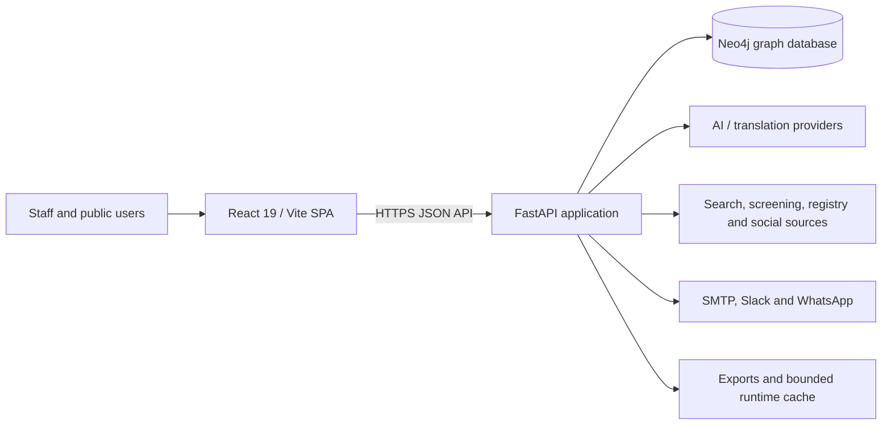

# Architecture and Data

## System context

## Runtime components

- `React/Front end/src/app` supplies the shell; `src/config/modules.jsx` registers modules and navigation.
- `src/modules` owns feature UI; `src/services/api.js` is the main backend boundary; runtime auth/configuration is under `src/services` and `src/config`.
- `React/Back end/app.py` loads environment settings and exposes the FastAPI package.
- `deliberation/api/app/main.py` configures CORS, authentication middleware, routers, health checks, startup constraints, and exception handling.
- `app/api/router.py` composes platform, CRM, deliberation, campaigns/audience, due-diligence, data-hub, data-chat, and translation routers.
- `app/db.py` owns Neo4j connectivity and baseline constraints. Feature modules add domain queries and, in some cases, feature-specific constraints.

## Request and trust boundaries

1. The browser loads public runtime configuration and sends credentials in headers.
2. CORS limits which browser origins may call the API; it is not authentication.
3. Authentication middleware checks all routes except explicit public rules.
4. Route handlers validate request shapes and run Neo4j queries or approved external calls.
5. External responses are untrusted input: normalize, bound, cite, and retain provenance.
6. Outputs return to the browser or to configured export/cache directories.

## Data domains

The graph includes people/supporters, segments, events/tasks, campaigns/messengers, conversations/participants/comments/votes/themes, analysis runs/pages/chunks/clusters, and investigation cases/entities/sources/evidence/statements/findings/publications. Startup constraints enforce identifiers for core deliberation and investigation nodes; consult `app/db.py` and feature-specific constraint lists for current names.

Key modeling rules:

- Use stable generated identifiers, never mutable names or emails, as graph identity.
- Preserve original source, retrieval time, source record identifier, and transformation history.
- Keep asserted facts separate from inferred matches and analyst findings.
- Make identity-resolution decisions reversible and record reviewer, timestamp, rationale, and confidence.
- Do not silently merge people or organizations across sources.
- Treat deletions as domain operations that also consider relationships, exports, caches, backups, and legal holds.

## Availability and consistency

The API initializes constraints on startup but remains reachable in a degraded state if database bootstrap fails. Neo4j is the system of record for active domain data; file exports and CRM snapshots are derivatives. External connectors are independently fallible and must expose actionable failure states without corrupting stored evidence.

## Architecture decisions

Record consequential choices in `docs/adr/NNNN-short-title.md` with status, context, decision, alternatives, consequences, security/privacy impact, and date. Use an ADR for the authentication model, schema migration strategy, new external processors, retention model, API versioning, or hosting changes.

