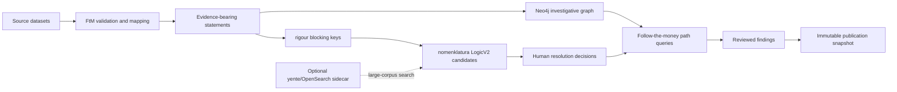

# Due Diligence: reusable OpenSanctions stack

Research date: 2026-08-07

## Decision

Freedom Square should use the maintained OpenSanctions data standards and
matching libraries as a toolkit, not deploy the historical Aleph monolith and
not replace the evidence model already stored in Neo4j.

The DD module remains an analyst-controlled investigation system:

1. ingest source-scoped records;
2. preserve every assertion and its provenance;
3. normalize and block possible identities;
4. score candidate pairs with explainable features;
5. require a human accept/reject/defer judgement;
6. explore paths and promote only reviewed leads to findings;
7. publish immutable snapshots of accepted findings.

## Repository audit

| Project | Current role | Decision for FS |
|---|---|---|
| [opensanctions/followthemoney](https://github.com/opensanctions/followthemoney) | Ontology, entity validation, normalization, table mapping, statements and export formats | Adopt as the canonical interchange model. Native FtM import is implemented. |
| [opensanctions/rigour](https://github.com/opensanctions/rigour) | Production normalization and validation for names, identifiers, dates, addresses, countries, phones and business descriptors | Adopt for production normalization and blocking. Keep a portable Unicode fallback for Windows development. |
| [opensanctions/nomenklatura](https://github.com/opensanctions/nomenklatura) | FtM entity integration, blocking, resolver judgements and explainable LogicV2 matching | Adopt LogicV2 scoring and feature explanations when available. Keep decisions in our Neo4j case model. |
| [opensanctions/yente](https://github.com/opensanctions/yente) | FastAPI search, batch matching and OpenRefine reconciliation over Elasticsearch/OpenSearch | Add later as an optional sidecar when corpus size justifies a search index. Do not require it for the current AuraDB-sized deployment. |
| [opensanctions/followthemoney-graph](https://github.com/opensanctions/followthemoney-graph) | FtM-to-Neo4j projection and reification of identifiers, addresses, phones, emails, URLs and names | Reuse its graph-mapping ideas. Do not use it as the authoritative store because its property graph projection does not retain our per-statement evidence links. |
| [opensanctions/datapatch](https://github.com/opensanctions/datapatch) | Versionable YAML corrections for messy source values | Adopt in the ingestion layer for explicit, reviewable source-specific fixes. Never silently rewrite source evidence. |
| [opensanctions/opensanctions](https://github.com/opensanctions/opensanctions) | Source crawlers, sanctions/PEP dataset build, cleaning, dedupe and exports | Reuse its published API/data subject to the applicable dataset license; do not copy its entire build system into FS. |
| [alephdata/aleph](https://github.com/alephdata/aleph) | Historical investigative search and document platform | Do not adopt as a base. The legacy repository announced maintenance ended after 2025. Reuse product lessons only. |
| [opensanctions/fingerprints](https://github.com/opensanctions/fingerprints) | Previous name/address fingerprint library | Do not add. It is unmaintained and incorporated into `rigour`. |
| Archived `zavod`, `bahamut`, `storyweb`, and one-off converter repositories | Historical ingestion and research experiments | Use only as references for source mappings. Do not make them runtime dependencies. |

All selected library code is MIT-licensed at the time of this audit. Data is a
separate concern: each dataset's license, publisher, jurisdiction, access URL,
and import run must remain recorded. In particular, an MIT API server does not
make every served OpenSanctions dataset commercially unrestricted.

## Runtime architecture



## Implemented backend integration

### Native FollowTheMoney ingestion

`POST /due-diligence/cases/{caseId}/graph/import/ftm`

Request:

```json
{
  "dataset": {
    "id": "company-register",
    "name": "Company Register",
    "url": "https://registry.example/",
    "publisher": "Registry Authority",
    "license": "Open data",
    "jurisdiction": "GE"
  },
  "entities": [
    {
      "id": "person-1",
      "schema": "Person",
      "properties": {
        "name": ["Jane Doe"],
        "birthDate": ["1980-01-02"]
      }
    },
    {
      "id": "company-1",
      "schema": "Company",
      "properties": {
        "name": ["Example Holdings LLC"],
        "registrationNumber": ["REG-1234567"]
      }
    },
    {
      "id": "directorship-1",
      "schema": "Directorship",
      "properties": {
        "director": ["person-1"],
        "organization": ["company-1"],
        "role": ["Director"],
        "startDate": ["2024-01-01"],
        "sourceUrl": ["https://registry.example/record/1"]
      }
    }
  ]
}
```

Integrity rules:

- entity IDs must be unique inside an import request;
- IDs are source-scoped and are never silently merged across datasets;
- an edge endpoint must resolve to an imported ID or an entity explicitly
  attached with `existingEntityId`;
- FtM interstitial entities such as `Ownership`, `Directorship`,
  `ContractAward`, and `Payment` become graph relationships, but retain their
  FtM ID and properties as statement subjects;
- every imported node and relationship receives evidence and source lineage;
- FtM values rejected by the official validator are reported as import
  warnings;
- each request creates an immutable import-run audit record.

### Runtime capability discovery

`GET /due-diligence/toolkit/capabilities`

This reports whether the official `followthemoney`, `rigour`, and
`nomenklatura` libraries are active or the portable compatibility layer is in
use. Official libraries are enabled automatically on supported deployments.

### Resolution improvements

The existing resolution-candidate response remains backwards compatible and
now includes `matchingEngine`:

- `nomenklatura-logic-v2` when the official stack is present;
- `evidence-rule-v1` in the portable development fallback.

Candidate signals remain explainable and may include name, identifier,
address, birth-date, country, gender, LEI, tax ID, vessel identifier, or other
schema-specific comparisons. A score ranks work; it never confirms identity.

## Next adoption stages

1. Add version-controlled `datapatch` rules to dataset mappings, with the raw
   source value preserved beside every corrected value.
2. Add reified match-value pivots for identifiers, addresses, emails, phones,
   URLs and normalized names; prune only pivots with no cross-entity value.
3. Deploy yente/OpenSearch only when full-corpus candidate generation becomes
   too expensive in Neo4j.
4. Add connector packs for Georgian company, procurement, beneficial ownership,
   land/property, court, donation and PEP data using native FtM output.
5. Add continuous source freshness, schema drift, import anomaly and provenance
   completeness monitoring.

## Non-negotiable safeguards

- A candidate match is not an identity.
- A graph path is not proof of corruption.
- A sanctions/PEP hit is not proof of wrongdoing.
- Sourced, inferred, analyst-added and hypothetical assertions stay visually
  and structurally distinct.
- Contradictory statements are retained, not overwritten.
- Publication uses accepted findings and frozen evidence references only.
