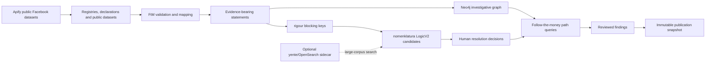

# Due Diligence: reusable OpenSanctions stack

Research date: 2026-08-07

## Decision

Civic Voice Lab should use the maintained OpenSanctions data standards and
matching libraries as a toolkit, not deploy the historical Aleph monolith and
not replace the evidence model already stored in Neo4j.

The DD module remains an analyst-controlled investigation system:

1. ingest source-scoped records;
2. preserve every assertion and its provenance;
3. normalize and block possible identities;
4. score candidate pairs with explainable features;
5. require a human accept/reject/defer judgement;
6. explore paths and promote only reviewed leads to findings;
7. publish immutable snapshots of accepted findings.

## Repository audit

| Project | Current role | Decision for FS |
|---|---|---|
| [opensanctions/followthemoney](https://github.com/opensanctions/followthemoney) | Ontology, entity validation, normalization, table mapping, statements and export formats | Adopt as the canonical interchange model. Native FtM import is implemented. |
| [opensanctions/rigour](https://github.com/opensanctions/rigour) | Production normalization and validation for names, identifiers, dates, addresses, countries, phones and business descriptors | Adopt for production normalization and blocking. Keep a portable Unicode fallback for Windows development. |
| [opensanctions/nomenklatura](https://github.com/opensanctions/nomenklatura) | FtM entity integration, blocking, resolver judgements and explainable LogicV2 matching | Adopt LogicV2 scoring and feature explanations when available. Keep decisions in our Neo4j case model. |
| [opensanctions/yente](https://github.com/opensanctions/yente) | FastAPI search, batch matching and OpenRefine reconciliation over Elasticsearch/OpenSearch | Add later as an optional sidecar when corpus size justifies a search index. Do not require it for the current AuraDB-sized deployment. |
| [opensanctions/followthemoney-graph](https://github.com/opensanctions/followthemoney-graph) | FtM-to-Neo4j projection and reification of identifiers, addresses, phones, emails, URLs and names | Reuse its graph-mapping ideas. Do not use it as the authoritative store because its property graph projection does not retain our per-statement evidence links. |
| [opensanctions/datapatch](https://github.com/opensanctions/datapatch) | Versionable YAML corrections for messy source values | Adopt in the ingestion layer for explicit, reviewable source-specific fixes. Never silently rewrite source evidence. |
| [opensanctions/opensanctions](https://github.com/opensanctions/opensanctions) | Source crawlers, sanctions/PEP dataset build, cleaning, dedupe and exports | Reuse its published API/data subject to the applicable dataset license; do not copy its entire build system into FS. |
| [alephdata/aleph](https://github.com/alephdata/aleph) | Historical investigative search and document platform | Do not adopt as a base. The legacy repository announced maintenance ended after 2025. Reuse product lessons only. |
| [opensanctions/fingerprints](https://github.com/opensanctions/fingerprints) | Previous name/address fingerprint library | Do not add. It is unmaintained and incorporated into `rigour`. |
| Archived `zavod`, `bahamut`, `storyweb`, and one-off converter repositories | Historical ingestion and research experiments | Use only as references for source mappings. Do not make them runtime dependencies. |

All selected library code is MIT-licensed at the time of this audit. Data is a
separate concern: each dataset's license, publisher, jurisdiction, access URL,
and import run must remain recorded. In particular, an MIT API server does not
make every served OpenSanctions dataset commercially unrestricted.

## Runtime architecture



## Implemented backend integration

### Native FollowTheMoney ingestion

`POST /due-diligence/cases/{caseId}/graph/import/ftm`

Request:

```json
{
  "dataset": {
    "id": "company-register",
    "name": "Company Register",
    "url": "https://registry.example/",
    "publisher": "Registry Authority",
    "license": "Open data",
    "jurisdiction": "GE"
  },
  "entities": [
    {
      "id": "person-1",
      "schema": "Person",
      "properties": {
        "name": ["Jane Doe"],
        "birthDate": ["1980-01-02"]
      }
    },
    {
      "id": "company-1",
      "schema": "Company",
      "properties": {
        "name": ["Example Holdings LLC"],
        "registrationNumber": ["REG-1234567"]
      }
    },
    {
      "id": "directorship-1",
      "schema": "Directorship",
      "properties": {
        "director": ["person-1"],
        "organization": ["company-1"],
        "role": ["Director"],
        "startDate": ["2024-01-01"],
        "sourceUrl": ["https://registry.example/record/1"]
      }
    }
  ]
}
```

Integrity rules:

- entity IDs must be unique inside an import request;
- IDs are source-scoped and are never silently merged across datasets;
- an edge endpoint must resolve to an imported ID or an entity explicitly
  attached with `existingEntityId`;
- FtM interstitial entities such as `Ownership`, `Directorship`,
  `ContractAward`, and `Payment` become graph relationships, but retain their
  FtM ID and properties as statement subjects;
- every imported node and relationship receives evidence and source lineage;
- FtM values rejected by the official validator are reported as import
  warnings;
- each request creates an immutable import-run audit record.

### Runtime capability discovery

`GET /due-diligence/toolkit/capabilities`

This reports whether the official `followthemoney`, `rigour`, and
`nomenklatura` libraries are active or the portable compatibility layer is in
use. Official libraries are enabled automatically on supported deployments.

### Resolution improvements

The existing resolution-candidate response remains backwards compatible and
now includes `matchingEngine`:

- `nomenklatura-logic-v2` when the official stack is present;
- `evidence-rule-v1` in the portable development fallback.

Candidate signals remain explainable and may include name, identifier,
address, birth-date, country, gender, LEI, tax ID, vessel identifier, or other
schema-specific comparisons. A score ranks work; it never confirms identity.

### Apify public Facebook-group ingestion

The linked actor is integrated as an import-only connector. FS never starts an
actor automatically, because starting a run consumes the investigator's Apify
credits. Investigators can import an existing `runId`, an existing `datasetId`,
or exported JSON items:

`POST /due-diligence/cases/{caseId}/social/import/apify-facebook`

```json
{
  "runId": "228N9N1ObLdzd223M",
  "actorId": "2chN8UQcH1CfxLRNE",
  "maxItems": 200,
  "includeTopComments": true,
  "promotePostsToGraph": true,
  "lawfulBasis": "Documented public-interest investigation",
  "investigationPurpose": "Examine a defined public-procurement relationship",
  "retentionDays": 180
}
```

Use `GET /due-diligence/connectors/apify-facebook/capabilities` to see whether
the server-side `APIFY_API_TOKEN` is configured. The token is never accepted in
a request body or returned to the browser. Supplying `items` lets an analyst
import an exported dataset without configuring a token.

The importer maps actor records as follows:

| Actor record | Investigation model | Treatment |
|---|---|---|
| Group | `Social group` / FtM `Organization` | Stable platform URL/title, source-scoped identifier |
| Post author | `Social profile` / FtM `Person` record | Display name is a sourced social alias, not an official identity |
| Post | `Social post` / FtM `Article` | Text excerpt, URL, timestamps, engagement snapshot, attachment OCR |
| Top comment author | `Social profile` | Platform ID/URL where present; otherwise scoped to group and display name |
| Top comment | `Social comment` / FtM `Article` | Comment evidence linked to its profile and parent post |

Raw actor records are not stored. FS stores a SHA-256 checksum, source record
key, run/dataset IDs, source URL, a bounded evidence excerpt, collection method,
and retention deadline. Re-importing the same source record is idempotent.

### Alias and identity model

An official person and a Facebook profile remain separate nodes until a human
resolves them. Each `HAS_INVESTIGATION_NAME` assertion records:

- display and normalized value;
- `aliasType` (`official-name`, `source-alias`, or `social-display`);
- platform, source IDs, and evidence IDs;
- assertion kind and verification status.

`GET /due-diligence/cases/{caseId}/entities/{entityId}/aliases` returns aliases
for that entity and, by default, accepted members of its canonical identity
cluster. Search can find an entity by an alias without changing its canonical
display name. Shared identifiers, emails, phones, addresses, URLs, and names
generate explainable resolution candidates; common values shared by more than
50 entities are not expanded into pairwise candidates. No score causes an
automatic merge.

### Extensible asset nodes

The graph schema and frontend icon system support `Vehicle`, `Real estate`,
`Vessel`, and `Airplane` alongside people, organizations, contracts, addresses,
documents, and social records. These asset nodes must come from a cited registry,
declaration, reviewed extraction, or native FtM import. Unstructured social text
does not automatically become an ownership fact.

### Georgian corporate-registry enrichment

The Companyinfo adapter is identification-code only; it cannot enumerate the
registry. It normalizes company legal fields, current and former directors,
shareholders, owners, related companies, relationship dates/shares, indicator
records, and source-document links. Companyinfo assertions remain secondary
and carry a monthly-update caveat. NAPR verification is recorded separately as
an authoritative, analyst-submitted assertion.

The Companyinfo JSON interface is undocumented, so the connector is disabled
by default. Both `FS_COMPANYINFO_ENABLED=1` and
`FS_COMPANYINFO_PERMISSION_ACKNOWLEDGED=1` are required before the backend will
make a request. A disabled request returns HTTP 403 before creating a job or
calling the source. NAPR automation is always disabled; FS does not bypass
CAPTCHA, authentication, robots rules, or access controls.

Personal identifiers are neither accepted from the browser nor returned or
stored raw. If `FS_DD_ID_HASH_KEY` is configured, a personal ID received in a
source payload can be used in memory to derive a keyed HMAC for deterministic
source-record identity; neither the raw value nor HMAC is exposed as a graph
property. Snapshots store a sanitized normalized payload and the original
payload's SHA-256 hash because the project has no encrypted raw-artifact vault.

Implemented routes:

- `GET /due-diligence/connectors/georgian-company-registry/capabilities`
- `GET /due-diligence/cases/{caseId}/corporate-enrichment/sources`
- `POST /due-diligence/cases/{caseId}/corporate-enrichment/companyinfo`
- `GET /due-diligence/cases/{caseId}/corporate-enrichment/jobs/{jobId}`
- `GET /due-diligence/cases/{caseId}/entities/{entityId}/corporate-registry`
- `POST /due-diligence/cases/{caseId}/entities/{entityId}/corporate-registry/napr-verification`

### Generic source-adapter contract

`GET /due-diligence/source-adapters` exposes contract version 1.0 and the
governance state of every implemented or planned adapter. It includes source
owner, authority tier, jurisdiction, canonical/terms URLs, licence and
attribution, access and quota mode, allowed purpose/fields, retention and
redaction, cadence/cursor, completeness/watermark, parser/mapping versions,
artifact policy, corrections/tombstones, and a kill switch.

The common evidence chain is:

```text
immutable permitted artifact (or sanitized snapshot + raw hash)
  -> parsed source record
  -> source-scoped temporal statement
  -> resolution candidate and analyst judgement
  -> canonical entity view
```

Identifiers are typed and issuer-scoped. Georgian company numbers use
`GE-NAPR`, LEIs use `GLEIF`, IMO numbers use `IMO`, and otherwise an identifier
defaults to source scope. Equal numeric text from unrelated registries cannot
create a resolution candidate.

The staged connector catalogue records, but does not blindly enable, these
next sources:

1. GLEIF after its terms/attribution are recorded;
2. official UN, OFAC, EU, and current UK Sanctions List feeds source by source;
3. ICIJ Offshore Leaks with ODbL/CC BY-SA attribution and an explicit
   non-wrongdoing caveat;
4. OpenSanctions only with the appropriate business licence;
5. Georgia SPA and NBG only after current feed permission or a data-sharing
   agreement is obtained.

## Next adoption stages

1. Add version-controlled `datapatch` rules to dataset mappings, with the raw
   source value preserved beside every corrected value.
2. Add a reviewed mention-extraction queue for organization, vehicle, property,
   vessel and aircraft references found in documents and public social posts.
3. Deploy yente/OpenSearch only when full-corpus candidate generation becomes
   too expensive in Neo4j.
4. Add connector packs for Georgian company, procurement, beneficial ownership,
   land/property, court, donation and PEP data using native FtM output.
5. Add continuous source freshness, schema drift, import anomaly and provenance
   completeness monitoring.

## Non-negotiable safeguards

- A candidate match is not an identity.
- A graph path is not proof of corruption.
- A sanctions/PEP hit is not proof of wrongdoing.
- Sourced, inferred, analyst-added and hypothetical assertions stay visually
  and structurally distinct.
- Contradictory statements are retained, not overwritten.
- A social display name is not evidence that a profile is the official person.
- Collect only public content with a documented purpose and lawful basis.
- Do not infer sensitive traits or private relationships from engagement data.
- Publication uses accepted findings and frozen evidence references only.
